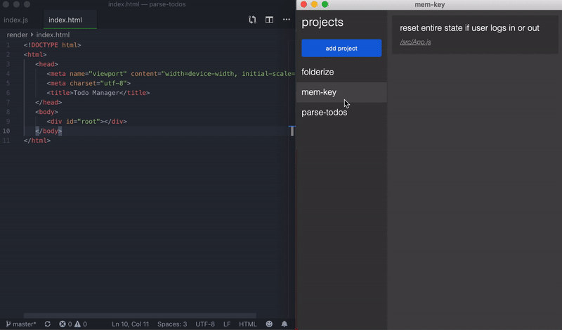

# todo-gui
GUI for managing todo comments within a project

### demo


### run locally

##### install dependancies
```
npm install
```

##### build
```
npm run build
```
or
```
npm run watch
```

##### run
```
npm start
```

### license
MIT